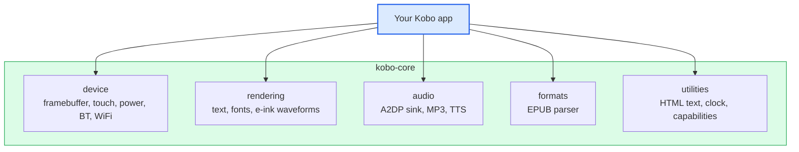

# kobo-core

[](https://crates.io/crates/kobo-core)
[](https://docs.rs/kobo-core)
[](LICENSE)

A reusable **Kobo e-reader device SDK** for Rust. Provides hardware abstractions,
rendering primitives, audio infrastructure, and EPUB parsing for any Kobo e-ink
application.

Part of the **KoThok e-reader ecosystem**:

| Repo | Role |
|---|---|
| **KoThok (EReader)** | E-reader app built on kobo-core |
| [**kobo-core**](https://crates.io/crates/kobo-core) (this) | Device SDK (framebuffer, touch, audio, EPUB) |
| [**kothok-edge-tts**](https://crates.io/crates/kothok-edge-tts) | Edge TTS client (re-exported via the audio feature) |

## Architecture



Four feature-gated modules, pick what you need:

| Module | Feature | What it provides |
|--------|---------|------------------|
| `device` | `device` | Framebuffer + e-ink refresh, touch input, power button, frontlight, wakelocks, battery, WiFi, Bluetooth, device detection |
| `rendering` | `rendering` | Text engine (HarfBuzz + fontdue), e-ink waveform constants, dirty-region diffing, image decode (PNG/JPEG/GIF/BMP) |
| `audio` | `audio` | A2DP sink, PCM player with paced writes, MP3 decode + resample, TTS synthesis orchestration |
| `formats` | `reader` | EPUB parsing: chapter extraction, cover image, metadata |

All enabled by default. Disable what you don't need:

```toml
# A music player: device + audio only
kobo-core = { version = "0.2", default-features = false, features = ["device", "audio"] }
```

## Install

```bash
cargo add kobo-core
```

## Quick start

```rust,no_run
use kobo_core::device;

// Auto-detect which Kobo model is running
let cfg = device::detect::detect_device().expect("unknown Kobo");
println!("{} ({}dpi, {})", cfg.model, cfg.display_dpi, cfg.codename);

// Framebuffer + e-ink refresh
use kobo_core::device::fb::Fb;
use kobo_core::rendering::eink::WAVE_GC16;
if let Some(fb) = Fb::open() {
    let rgb565_bytes = vec![0u8; fb.xres * fb.yres * 2];
    fb.present(&rgb565_bytes, fb.xres, fb.yres, false, 0, fb.yres, WAVE_GC16);
}

// Frontlight brightness
use kobo_core::device::power;
if let Some(path) = power::frontlight_path(&cfg.frontlight) {
    power::frontlight_set(&path, 50);
}

// Battery
let pct = device::battery::battery_pct();
println!("Battery: {pct}%");
```

## Supported devices

| Model | Codename | SoC | Color | BT |
|---|---|---|---|---|
| Libra Colour | monza / monzaKobo | MTK | Yes | Yes |
| Clara Colour | spaColour | MTK | Yes | Yes |
| Clara BW | spaBW / spaKoboBW | MTK | No | Yes |
| Elipsa 2E | condor | MTK | No | Yes |
| Sage | cadmus | sunxi | No | Yes |
| Libra 2 | io | NXP | No | Yes |
| Clara 2E | goldfinch | NXP | No | Yes |
| Clara HD | nova | NXP | No | No |
| Forma | frost | NXP | No | No |
| Forma 32GB | storm | NXP | No | No |
| Nia | luna | NXP | No | No |
| Elipsa | elipsa | NXP | No | No |
| Aura ONE | pika | NXP | No | No |
| Aura H2O | dahlia | NXP | No | No |
| Glo HD | alyssum | NXP | No | No |
| Aura SE | star | NXP | No | No |
| Aura | snow | NXP | No | No |
| Aura HD | dragon | NXP | No | No |
| Glo | kraken | NXP | No | No |
| Mini | pixie | NXP | No | No |
| Touch | trilogy | NXP | No | No |

Device detection is automatic from `/sys/devices/soc0/machine` (codename).

## E-ink waveforms

```rust
use kobo_core::rendering::eink;

// Pick the right waveform for each scenario
let transition = eink::waveform_for(eink::RenderScenario::Transition); // GL16
let content    = eink::waveform_for(eink::RenderScenario::Content);    // GL16
let animation  = eink::waveform_for(eink::RenderScenario::Animation);  // A2
```

| Constant | Value | Use case |
|----------|-------|----------|
| `WAVE_INIT` | 0 | Boot/clear |
| `WAVE_DU` | 1 | Fast monochrome |
| `WAVE_GC16` | 2 | Full grayscale clearing |
| `WAVE_GL16` | 3 | Partial updates, less ghosting |
| `WAVE_A2` | 4 | Animation (fastest, monochrome) |
| `WAVE_GLR16` | 5 | MTK color optimized |
| `WAVE_GLD16` | 6 | MTK color dark |

## API reference

Complete alphabetical list of major public exports.

| Name | Kind | Module | Description |
|------|------|--------|-------------|
| `battery_pct` | fn | device::battery | Battery percentage (0-100) |
| `Capabilities` | trait | capabilities | Query WiFi/BT/battery/clock state |
| `Chapter` | struct | formats | EPUB chapter: title, XHTML content |
| `decode_image` | fn | rendering::text_render | Decode PNG/JPEG/GIF/BMP to RGB565 |
| `detect_script` | fn | rendering::text_render | Detect text script (Latin, Arabic, Bengali, CJK, etc.) |
| `detect_device` | fn | device::detect | Auto-detect Kobo model from sysfs |
| `DeviceConfig` | struct | device::config | Model name, codename, DPI, SoC, touch protocol |
| `diff_rows` | fn | rendering::eink | Compare two buffers, return dirty row range |
| `EpubBook` | struct | formats | Parsed EPUB: chapters, cover, metadata |
| `Fb` | struct | device::fb | Framebuffer mmap + e-ink refresh ioctl |
| `frontlight_get` | fn | device::power | Read current brightness (returns `Option<u32>`) |
| `frontlight_path` | fn | device::power | Locate frontlight sysfs path from `FrontlightConfig` |
| `frontlight_set` | fn | device::power | Set brightness (0-100) |
| `init_tls` | fn | audio | Install rustls crypto provider (for TTS) |
| `install_font` | fn | rendering::text_render::fonts | Register a font for a script |
| `MockCapabilities` | struct | capabilities | Test mock for `Capabilities` trait |
| `Player` | struct | audio::player | A2DP PCM player with paced writes |
| `Prepared` | struct | audio::player | Decoded PCM + word boundaries |
| `set_rtl` / `is_rtl` | fn | rendering::common | Set/read RTL text direction flag |
| `slice_as_bytes` | fn | rendering::common | Reinterpret slice as `&[u8]` (generic) |
| `synthesize_prepared` | fn | audio::synth | TTS synthesis with retry + gap baking |
| `waveform_for` | fn | rendering::eink | Pick waveform by `RenderScenario` |
| `wifi_status` | fn | device::wifi | Check if WiFi is connected |
| `wifi_toggle` | fn | device::wifi | Turn WiFi on/off (manages wpa_supplicant) |

## Build

```bash
# Native (for tests)
cargo build
cargo test

# Cross-compile for Kobo (armv7)
cross build --target armv7-unknown-linux-musleabihf --release
```

## Related projects

- **KoThok (EReader)**: the e-reader app built on this SDK
- [**kothok-edge-tts**](https://crates.io/crates/kothok-edge-tts): Microsoft
  Edge TTS client (re-exported via the `audio` feature)

## License

MIT
